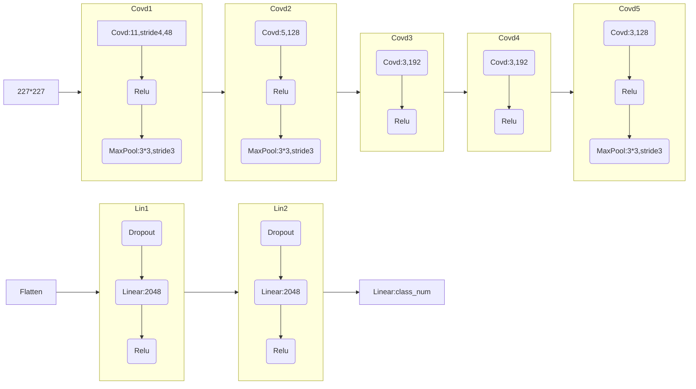
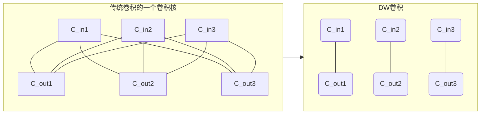
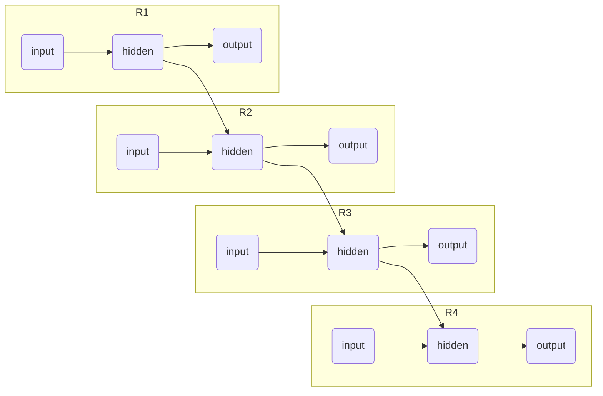
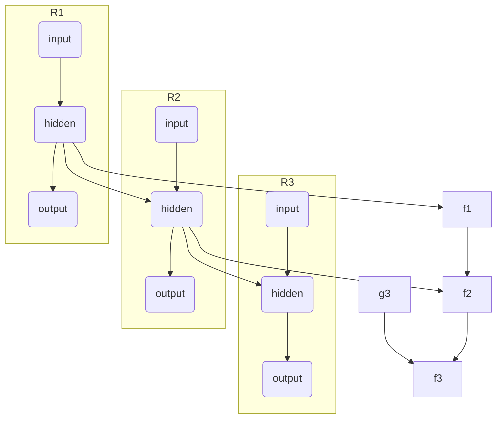

## CNN及其变种-网络优化：Convolutional Neural Network

### 传统CNN及其概念

- **Kernel_Size**：卷积核大小
- **Feature**：**特征**，一般经过一个卷积核之后得到的为一个**特征**，得到的矩阵也被称为**特征矩阵**
- **Channel**：**通道数量**，即可理解为一个矩阵的三维重叠数量，也被称之为**dim维度**，或**Width宽度**，inchannel到outchannel的变化也因此被称为**升维**或者**降维**，网络维度越高
- **Depth**：**深度**，一般称网络的深度，即为网络的层数，==网络越深则能得到更丰富复杂的**特征**==，但容易梯度消失/爆炸
- **Resolution**：**分辨率**，一般是矩阵的长和宽的大小

### LeNet：

首个成功应用的CNN架构，奠定**卷积**-**池化**-全连接范式

### AlexNet：

- **ReLU激活函数**：解决梯度消失，训练速度提升6倍。

- **==Dropout层==**：全连接层随机失活，抑制过拟合（错误率↓15%）。

- **GPU并行训练**：双卡实现1.2亿参数模型训练。


结构举例
     




​     

### **VGGNet**：

**深度与小卷积核**的极致平衡

- 全部采用3×3卷积（替代AlexNet的11×11/5×5）
- 深度扩展至16-19层（VGG-16/19）
- 线性层与Alexnet相同

结构就是**多重卷积穿插池化**，卷积全部为3x3，stride=1，padding=1

```py
#M为maxpool
#数字为out_channel
cfgs={
    'vgg11':[64,'M',128,'M',256,256,'M',512,512,'M',512,512,'M'],
    'vgg13':[64,64,'M',128,128,'M',256,256,'M',512,512,'M',512,512,'M'],
    'vgg16':[64,64,'M',128,128,'M',256,256,256,'M',512,512,512,'M',512,512,512,'M'],
    'vgg19':[64,64,'M',128,128,'M',256,256,256,256,'M',512,512,512,512,'M',512,512,512,512,'M'],
}
```


### ==ResNet==：残差神经网络

解决了**深层神经网络**训练的**梯度消失/爆炸问题**

- ResNet 使用**跳跃连接（Shortcut"捷径"）**直接将前层信息传递到后层

$$
H(x)=Net(x)+x
$$

- 在每个卷积后加BatchNorm归一化层==（后面紧随BN层的卷积可以设置Bias为False以减少开销）==

#### 残差网络结构

- #### 普通残差块

     - ##### BasicBlock

          **出入长宽（stride=1）**，**深度相同**，使用两个3x3的卷积核

          ```mermaid
          flowchart LR;
          	in,256 --> C1(3x3,256) --Relu--> C2(3x3,256) --> o((Add)) --Relu-->out,256
          	in,256 --> o
          ```

          

     - ##### Bottleneck

          - **出入长宽相同（stride=1）**

          - 先用1x1卷积核**降维（降channel/4）**

          - 再用相同深度3x3卷积连接**（同维=）**

          - 最后用1x1卷积升维使之与原来相同**（升维*4）**

          ```mermaid
          flowchart LR;
          	in,256 --> C1(1x1,64) --Relu--> C2(3x3,64) --Relu--> C3(1x1,256) --> o((Add)) --Relu-->out,256
          	in,256 --> o
          ```

- **每一个阶段的第一个残差块**，可能需要进行**下采样**（即缩减长宽，也就是stride>1），缩小长宽，增加通道深度

     在此块的第一个卷积，要进行下采样，即**stride=2，缩减长宽**，**但是同样也要将深度翻倍**。

     而在分支的”捷径“中，则需使用1x1的卷积核，控制stride，**使其长宽与主脉相同**

     - ##### BasicBlock

          - 主脉全部使用3x3
          - 先**下采样**，stride=2（缩减长宽），伴随着**升维（channel*2）**
          - 再保持长宽与维度**（同维=）**

          ```mermaid
          flowchart LR;
          	in,64 --> C1(3x3,128,stride:2) --Relu--> C2(3x3,128) --> o((Add)) --Relu-->out,128
          	in,64 -.-> CC(1x1,128,stride:2) -.-> o
          ```

     - ##### Bottleneck

          - 主脉先用1x1卷积核**降维（降channel/4）**并**下采样**（stride=2，伴随着**channel*2**）

          - 再用相同深度3x3卷积连接**（同维=）**

          - 最后用1x1卷积升维使之与原来相同**（升维*4）**

          ```mermaid
          flowchart LR;
          	in,256 --> C1(1x1,128,stride:2) --Relu--> C2(3x3,128) --Relu--> C3(1x1,512) --> o((Add)) --Relu-->out,512
          	in,256 -.-> CC(1x1,512,stride:2) -.-> o
          ```

### MobileNet_V1:

- 用DW卷积模拟卷积核通道数，分离一个卷积核的不同通道
- 用PW卷积模拟卷积核个数，逐点合并DW分离的通道
- **Depthwise Separable Convolution：深度可分离卷积**=DW+DP
- 但是DW的部分卷积核容易废掉，即卷积核大部分参数为零

#### DepthWise Conv：

深度卷积

- 将原本的卷积核的每一个（输出通道=卷积核个数），按照通道（输入通道=卷积核通道）分离，一个卷积核只负责输入的一个channel



#### PointWise Conv：

逐点卷积

- 用”点“的卷积核，将在DW中分离的通道，重新合起来

- 卷积核大小为1x1

### MobileNet_V2：

- #### 加入Inverted Residuals（倒残差结构）：中间大，两头小（先升维，再降维）

- #### Linear Bottlenecks

     - t是中间层的**t=维度拓展因子**
     - 如果stride>1，即进行**下采样Downsample**时，不进行残差连接
     - 如果inchannel != outchannel，进行**下采样Downsample**时，不进行残差连接
     - 仅在**每层的第一个残差**块进行**下采样(且若stride>1)+通道降维** ，其余保持in=out

     | Input                  | Operate                           | Output                            |
     | ---------------------- | --------------------------------- | --------------------------------- |
     | height,weight,deep     | 1x1 Conv2d,Relu6   (升维)         | height,weight,(t*deep)            |
     | height,weight,(t*deep) | 3x3 dwise&stride=s,Relu6   (同维) | h/s, w/s,  t*deep                 |
     | h/s, w/s,  t*deep      | linear 1x1 conv2d    (降维)       | h/s, w/s,  deep'(升维？同维=deep) |

     

     ```mermaid
     flowchart LR;
     	in,deep_in --> C1(Conv1x1/PW,deep_in*t) --Relu6--> C2(Dwise 3x3/DW,stride,deep_in*t) --Relu6--> C3(Conv1x1/PW,deep_out) --> o((Add)) -->out,deep_out
     	in,deep_in -.-> o
     ```

     

### MobileNet_V3：

- #### 加入**SE模块（Squeeze-and-Excitation：通道注意力机制）**

     - 在Dwise与降维卷积之间**加入全图平均池化**，之后扁平化，使一个通道对应一个权重

     - 再通过**两个全连接层**，一个**使用Relu**激活并**升维**相应倍数(一般为squeeze_factor=4)，一个**使用h-swish**激活并降维至原来

          特别注意的是，==这里的全连接层可以用1x1卷积代替==，以省略flatten和unflatten的步骤

     - 最后以此为权重，**与原来的通道进行相乘**

     

     ```mermaid
     flowchart LR;
     
     subgraph SE
     	avgpool,deep_in*t --> fc1,*squeeze_factor --relu--> fc,\squeeze_factor
     end
     	in,deep_in --> C1(Conv1x1/PW,deep_in*t) --NL--> C2(Dwise kxk/DW,stride,deep_in*t) --NL--> 	
     	SE --h-sigmoid--> x((⊗))
     	C2 --> x
     	x --> C3(Conv1x1/PW,deep_out) --> o((Add)) -->out,deep_out
     	
     	in,deep_in --> o
     ```

     

### EfficientNet

## RNN

### 传统的RNN

- **时刻**：在同一个**“RNN元”**，中的**不同“层”**，为区分传统意义上的深度的层，更形象的称之为**时刻**
- **隐藏状态：**输入和输出之间的，用于传递给下一个时刻的矩阵，称之为**隐藏状态**

$$
hidden^{<t>}=Act_{hidden}(W_h^{<t>}\cdot hidden^{<t-1>}+W_i^{<t>}\cdot input^{<t>}+b_h^{<t>})~~~隐藏状态\\
output^{<t>}=Act_{out}(W_o^{<t>}\cdot hidden^{<t>}+b_o^{<t>})~~~输出\\
$$








### LSTM（长短期记忆网络）：Long Short Term Memory

#### 传统RNN的劣势

- 传统的RNN仅基于前一时刻的hidden，仅能传递 **short term memory（Hidden State）**（简称stm了）


#### LSTM概念&革新

- 加入新的一条**时间线**，记录**long term memory（Cell State）**，平行于stm

- 在input输入到hidden中间，添加了**门gate**，**forget**和**input**门使用上一时刻**Hidden**和当前时刻**input**来更新**当前Cell**

     **output门**用当前时刻的**Cell**，**input**和上一时刻的**Hidden**更新当前时刻的**Hidden**

     - **forget gate**：遗忘门，决定**从Cell状态丢弃那些内容**，通过**本时刻input**和**上时刻stm（Hidden）**合并的新矩阵，通过**线性变换+sigmoid激活**，作为ltm（Cell）的遗忘权重与其相乘（哈达玛积）
          $$
          f^{<t>}=Sigmoid(W\cdot~\begin{bmatrix}hidden^{<t-1>}&input^{<t>}\end{bmatrix}+B_f^{<t>})~~~遗忘权重\\\\
          cell^{<t>}=f^{<t>}\odot cell^{<t-1>}~~~更新cell
          $$

     - **input gate**：输入门，决定**从Cell状态中存储哪些信息**

          - **Input Gate Activation**：输入门控制信号，控制**“信息的流量”**，即储存信息的**权重**
          - **Candidate Cell State**：候选记忆值，提供待存储的新信息的**内容**

          $$
          i^{<t>}=Sigmoid(W_i\cdot~\begin{bmatrix}hidden^{<t-1>}&input^{<t>}\end{bmatrix}+B_i)~~~储存权重\\\\
          \hat C^{<t>}=tanh(W_C\cdot~\begin{bmatrix}hidden^{<t-1>}&input^{<t>}\end{bmatrix}+B_C)~~~储存内容\\\\
          cell^{<t>}+=i^{<t>}\odot \hat C^{<t>}~~~更新cell
          $$

          

     - **output gate**：输出门，更新**stm（Hidden）**

          - **Output Gate Activation**：输出门控制信号，控制**“信息的流量”**，即输出信息的**权重**

          - qa

          $$
          o^{<t>}=Sigmoid(W_o\cdot~\begin{bmatrix}hidden^{<t-1>}&input^{<t>}\end{bmatrix}+B_o)~~~输出权重\\\\
          hidden^{<t>}+=o^{<t>}\odot tanh(cell^{<t>})~~~更新hidden，并直接作为输出
          $$

          


### Transformer（变形金刚bushi）