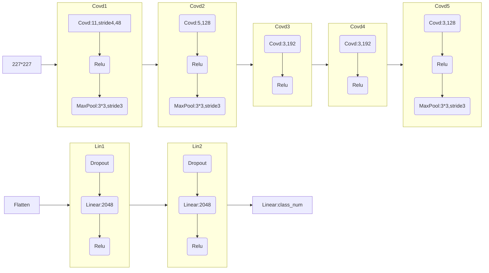
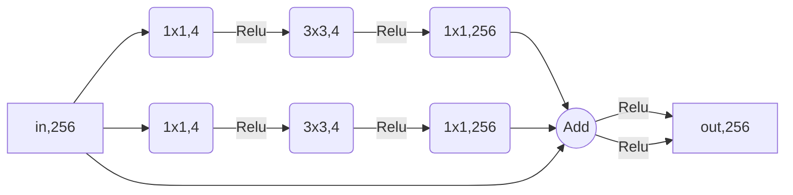
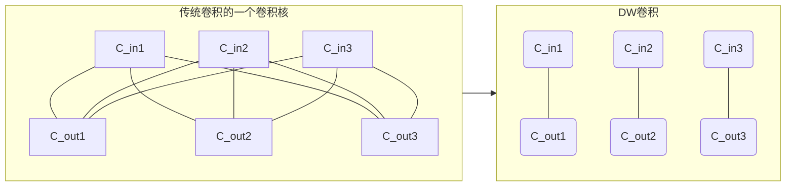
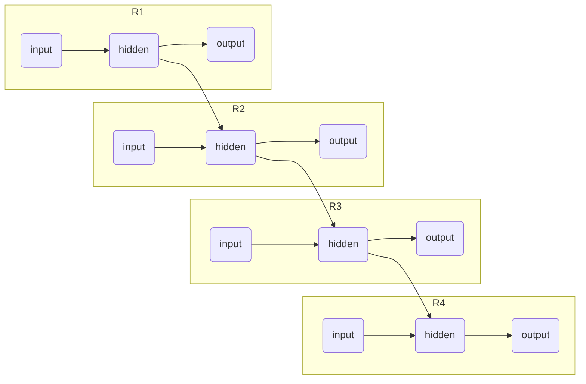

# 神经网络基础概念

## 层

### Linear Layers(Dense/Fully Connected/FC)：线性层(或全连接层)

#### 前向传播

- 多项式
     $$
     z_n=\Sigma\ x_{n-1}\cdot w_n+b \qquad 线性输出\\\\
     a_n=\sigma(z_n)  \qquad 激活输出\\\\
     x_n=a_n  \qquad 下一层输入
     $$

- 矩阵 
     $$
     Z_n=X_{n-1}\cdot W_n+B \qquad 线性输出\\\\
     A_n=\sigma(Z_n)  \qquad 激活输出\\\\
     X_n=A_n  \qquad 下一层输入
     $$

#### 反向传播

基础的部分梯度
$$
\frac{\partial X_t}{\partial Z_{t}}=\frac{\partial A_t}{\partial Z_{t}}=\sigma'(Z_t) \qquad 激活函数梯度\\\\

\frac{\partial Z_{t}}{\partial X_{t-1}}=W_t^T  \qquad 线性输出梯度\\\\

\frac{\partial L}{\partial X_n}=Loss'(X_n)  \qquad 损失梯度\\\\

\frac{\partial X_t}{\partial W_t}=X_{t-1}^T  \qquad 权重梯度\\\\

\frac{\partial X_t}{\partial B_t}=I  \qquad 偏置梯度\\\\
$$
接下来，通过链式求导法则，组合这些梯度
$$
\frac{\partial X_t}{\partial X_{t-1}}=W_t^T\odot\sigma'(Z_t)  \qquad 隐藏层梯度
$$

- 链式求导形式
     $$
     
     $$

- 递推公式形式

$$
\delta_{Loss}=\frac{\partial L}{\partial Z_n}=Loss'(A_n)\odot\sigma'(Z_n)  \qquad 损失\\\\

\delta_t=(W_{t+1}\odot\sigma'(Z_t))\cdot \delta_{t+1}	\qquad 隐藏层递推\\\\

\frac{\partial L}{\partial W_t}=\delta_t\cdot X_{t-1}^T	\qquad 权重梯度\\\\

\frac{\partial L}{\partial B_t}=\delta_t\cdot I=\delta_t	\qquad 偏置梯度\\\\
$$

- 累乘形式

$$
\frac{\partial L}{\partial W_t}=Loss'(A_n)\odot\sigma'(Z_n)\cdot \\ [(W_n^T\odot\sigma'(Z_{n-1}))\cdot(W_{n-1}^T\odot\sigma'(Z_{n-2}))\cdot\ ......\ \cdot(W_{t+1}^T\odot\sigma'(Z_{t}))]\cdot X_{t-1}^T	\qquad 权重梯度\\\\

\frac{\partial L}{\partial B_t}=Loss'(A_n)\odot\sigma'(Z_n)\cdot \\ [(W_n^T\odot\sigma'(Z_{n-1}))\cdot(W_{n-1}^T\odot\sigma'(Z_{n-2}))\cdot\ ......\ \cdot(W_{t+1}^T\odot\sigma'(Z_{t}))]  \qquad 偏置梯度\\\\
$$


### Convolution Layers：卷积层

前向传播

反向传播

- #### Convolution：传统卷积

     - 卷积核channel=输入特征矩阵channel
     - 卷积核个数=输出特征矩阵channel

- #### Grouped Convolution：分组卷积

     - 将输入特征，和输出特征同时分成相同数量的组
     - 仅相同组的输入特征和输出特征通过本组的卷积核连接
     - ResNeXt


- #### **Depthwise Separable Convolution：深度可分离卷积**=DW+DP

     - ##### Depthwise Convolution：深度卷积

          - 每一个group中的卷积核channel=1
          - 输入特征矩阵channel=卷积核个数=输出特征矩阵channel
          - 在torch中使用group分组进行实现，==每个卷积核仅与自己负责的channel连接==

     - ##### Pointwise Convolution：点卷积

          - 卷积核大小kernelsize=1
          - 将DW中被group分离的channel重新统一

     - MobileNet_V2


### Pooling Layers：池化层

- #### MaxPool：最大池化

- #### AveragePool：平均池化

### Dropout Layers：失活层

仅在训练时，使节点随机失活，以防止过拟合

### Normalization Layers：归一化层

mu为均值，sigma方为方差，epsilon为小常熟，防止出现0，最后用便宜缩放保证网络的表达能力
$$
\hat{x}=\frac{x_i-\mu}{\sqrt{\sigma^2-\epsilon}}~~~~~~~~~~~~
y_i=\hat{\gamma ~x_i+\beta}
$$

- #### BatchNormalization：批归一化
  
    在一个batch上，对坐标相同的点进行归一化
    
- #### LayerNormalization：层归一化
  
    在tensor的最后一个维度上进行归一化

### Recurrent Layers：循环层


### Embedding Layers：嵌入层

#### Embedding Matrix：嵌入矩阵

相当于一个抽象的**词表**

- ##### 矩阵的大小为E(vocab_num,embedding_dim)

     - **vocab_num**：**词汇表的大小**（有多少个不同的单词/符号）。
     - **embedding_dim**：**嵌入向量的维度**（用多长的一串数字来表示每个符号）。这是一个超参数，通常远小于 vocab_size（如 50, 100, 300）。
     - 矩阵的每一行对应一个词

- ##### 工作方式：索引映射

     - 每个符号（单词）在词汇表中都有一个**唯一的整数索引**（可粗略理解为行号，即每行对应一个词）。
     - 输入到 Embedding 层的是一个 **整数索引**，代表某个符号（比如输入i，则词为E[i，:])。

#### 前向传播：

传入索引，输出整行，即为选取代表这个词的一行

## NonLinear(NL)激活函数：Activation

- #### sigmoid：$sigmoid (x) = \frac {1}{1+e^{-x}}$

- #### h-sigmoid：$hsigmoid(x)=\frac{relu6(x+3)}{6}$

- #### tanh：

- #### relu：$relu(x)=max(0,x)$

- #### relu6：$min(6,max(0,x))$

- #### swish：$swish (x) = x ~\cdot~ sigmoid (x)$

- #### h-swish：$hswish (x) =x ~\cdot~ hsigmoid(x)= x ~\cdot~ \frac{Relu6 (x)}{6}$

- #### softmax：$softmax (x) = x ~\cdot~ sigmoid (x)$

     求一个向量（一个tensor）的每一个值的概率分布，将其值域归一化到[0, 1]

## Optimizer优化器：

### 基础梯度下降法

- #### SDG：Stochastic gradient descent，随机梯度下降
- #### Momentum：动量法
- #### NAG：Nesterov 加速梯度，动量法的改进版

### 自适应学习率算法

- #### Adagrad
  
    - 核心思想：为每个参数分配独立的学习率，根据历史梯度平方和调整。
    - 优点：适合稀疏数据（如自然语言处理）。
    - 缺点：学习率会逐渐衰减至零，导致后期训练停滞。
- #### Adadelta
  
    - 改进Adagrad：用梯度平方的滑动平均代替累积和，缓解学习率衰减问题。
    - 无需手动设置初始学习率。
- #### RMSprop
  
    - 核心思想：与Adadelta类似，使用梯度平方的指数移动平均（EMA）调整学习率。
    - 应用场景：适合非平稳目标函数（如RNN）。
- #### Adam（融合了Momentum）
  
    - 融合动量与自适应学习率：结合了动量法（一阶矩估计）和RMSprop（二阶矩估计）。
    - 优点：收敛快，鲁棒性强，是深度学习中的默认选择之一。
- #### Adamax
  
    - Adam的变体：使用无穷范数（L∞）调整学习率，对稀疏梯度更稳定。

### 其他方法

- #### LBFGS
  
    - 二阶优化算法：利用Hessian矩阵的近似实现更精确的更新。
    - 优点：收敛快，适合小规模数据。
    - 缺点：内存消耗大，不适合深度学习。
- #### Rprop
  
    - 仅使用梯度符号：忽略梯度幅值，根据梯度符号调整参数更新步长。
    - 适用场景：全批量训练（非随机梯度）。
- #### ASGD（平均随机梯度下降）
  
    - 对参数进行滑动平均：缓解SGD的震荡，提升稳定性。

## Weight Initialization-权重初始化

- ### Dim：Dimension-维度-通常指权重矩阵的维度（如 dim=(Din, Dout)）
  
    - #### Din：Input Dimension-某一层的输入神经元数量（或输入特征维度）
    - #### Dout：Output Dimension-该层的输出神经元数量（或输出特征维度）。
    
- ### std：standard deviation-标准差

- ### 初始化方法
    - #### Xavier：Xavier初始化-适用于Sigmoid
    - #### Glorot：Glorot初始化-适用于Tanh
    - #### Kaiming：Kaiming初始化-适用于ReLU
    - #### He：He初始化-适用于ReLU
- ### normal distribution：正态分布
    - #### Box-Muller算法：模拟极坐标随机圆盘，xy都服从正态分布
    - #### Marsaglia

## Loss-Function 损失函数

- ### 回归任务

     - #### MSELoss：Mean Squared Error（MSE）-均方误差损失

     - #### l1_loss：Mean Absolute Error（MAE）-L1 损失

- ### 分类任务

     - #### cross_entropy：Cross Entropy Loss（CE）-多分类交叉熵损失

     - #### binary_cross_entropy：Binary Cross Entropy Loss（BCE）二分类交叉熵损失（一般集成了Sigmoid）
- ### 其他任务

  - #### kl_div：KL 散度损失

  - #### huber_loss：Huber 损失（平滑 L1 损失，结合 MSE 和 MAE 的优点）

  - #### nll_loss：


## 机器学习类型

- #### 监督学习

     有input和label，通过标签学习

     - **分类**
     - **回归**

- #### 无监督学习

     无label，让机器自主发掘数据的内在结构

- #### 半监督学习

     综合前两者，只有少量的数据有label，大量的数据没有label

- #### 强化学习

     目标是开发一个智能体，通过环境返回来提高决策正确性

# CNN&变种：Convolutional Neural Network

### 传统CNN及其概念

- **Kernel_Size**：卷积核大小
- **Feature**：**特征**，一般经过一个卷积核之后得到的为一个**特征**，得到的矩阵也被称为**特征矩阵**
- **Channel**：**通道数量**，即可理解为一个矩阵的三维重叠数量，也被称之为**dim维度**，或**Width宽度**，inchannel到outchannel的变化也因此被称为**升维**或者**降维**，网络维度越高
- **Depth**：**深度**，一般称网络的深度，即为网络的层数，==网络越深则能得到更丰富复杂的**特征**==，但容易梯度消失/爆炸
- **Resolution**：**分辨率**，一般是矩阵的长和宽的大小

### CNN图像数据增强

- 翻转
- 裁剪

### LeNet：

首个成功应用的CNN架构，奠定**卷积**-**池化**-全连接范式

### AlexNet：	

- **ReLU激活函数**：解决梯度消失，训练速度提升6倍。

- **==Dropout层==**：全连接层随机失活，抑制过拟合（错误率↓15%）。

- **GPU并行训练**：双卡实现1.2亿参数模型训练。


结构举例
     




​     

### **VGGNet**：

**深度与小卷积核**的极致平衡

- 全部采用3×3卷积（替代AlexNet的11×11/5×5）
- 深度扩展至16-19层（VGG-16/19）
- 线性层与Alexnet相同

结构就是**多重卷积穿插池化**，卷积全部为3x3，stride=1，padding=1

```py
#M为maxpool
#数字为out_channel
cfgs={
    'vgg11':[64,'M',128,'M',256,256,'M',512,512,'M',512,512,'M'],
    'vgg13':[64,64,'M',128,128,'M',256,256,'M',512,512,'M',512,512,'M'],
    'vgg16':[64,64,'M',128,128,'M',256,256,256,'M',512,512,512,'M',512,512,512,'M'],
    'vgg19':[64,64,'M',128,128,'M',256,256,256,256,'M',512,512,512,512,'M',512,512,512,512,'M'],
}
```


### ==ResNet==：残差神经网络

解决了**深层神经网络**训练的**梯度消失/爆炸问题**

- ResNet 使用**跳跃连接（Shortcut"捷径"）**直接将前层信息传递到后层

$$
H(x)=Net(x)+x
$$

- 在每个卷积后加BatchNorm归一化层==（后面紧随BN层的卷积可以设置Bias为False以减少开销）==

#### 残差网络结构

- #### 普通残差块

     - ##### BasicBlock

          **出入长宽（stride=1）**，**深度相同**，使用两个3x3的卷积核

          ```mermaid
          flowchart LR;
          	in,256 --> C1(3x3,256) --Relu--> C2(3x3,256) --> o((Add)) --Relu-->out,256
          	in,256 --> o
          ```

          

     - ##### Bottleneck

          - **出入长宽相同（stride=1）**

          - 先用1x1卷积核**降维（降channel/4）**

          - 再用相同深度3x3卷积连接**（同维=）**

          - 最后用1x1卷积升维使之与原来相同**（升维*4）**

          ```mermaid
          flowchart LR;
          	in,256 --> C1(1x1,64) --Relu--> C2(3x3,64) --Relu--> C3(1x1,256) --> o((Add)) --Relu-->out,256
          	in,256 --> o
          ```

- **每一个阶段的第一个残差块**，可能需要进行**下采样**（即缩减长宽，也就是stride>1），缩小长宽，增加通道深度

     在此块的第一个卷积，要进行下采样，即**stride=2，缩减长宽**，**但是同样也要将深度翻倍**。

     而在分支的”捷径“中，则需使用1x1的卷积核，控制stride，**使其长宽与主脉相同**

     - ##### BasicBlock

          - 主脉全部使用3x3
          - 先**下采样**，stride=2（缩减长宽），伴随着**升维（channel*2）**
          - 再保持长宽与维度**（同维=）**

          ```mermaid
          flowchart LR;
          	in,64 --> C1(3x3,128,stride:2) --Relu--> C2(3x3,128) --> o((Add)) --Relu-->out,128
          	in,64 -.-> CC(1x1,128,stride:2) -.-> o
          ```

     - ##### Bottleneck

          - 主脉先用1x1卷积核**降维（降channel/4）**并**下采样**（stride=2，伴随着**channel*2**）

          - 再用相同深度3x3卷积连接**（同维=）**

          - 最后用1x1卷积升维使之与原来相同**（升维*4）**

          ```mermaid
          flowchart LR;
          	in,256 --> C1(1x1,128,stride:2) --Relu--> C2(3x3,128) --Relu--> C3(1x1,512) --> o((Add)) --Relu-->out,512
          	in,256 -.-> CC(1x1,512,stride:2) -.-> o
          ```

### ResNeXt

使用了**"Aggregated Transformations"（聚合变换）**，大大提高了计算效率




### MobileNet_V1:

- 用DW卷积模拟卷积核通道数，分离一个卷积核的不同通道
- 用PW卷积模拟卷积核个数，逐点合并DW分离的通道
- **Depthwise Separable Convolution：深度可分离卷积**=DW+DP
- 但是DW的部分卷积核容易废掉，即卷积核大部分参数为零

#### DepthWise Conv：

深度卷积

- 将原本的卷积核的每一个（输出通道=卷积核个数），按照通道（输入通道=卷积核通道）分离，一个卷积核只负责输入的一个channel



#### PointWise Conv：

逐点卷积

- 用”点“的卷积核，将在DW中分离的通道，重新合起来

- 卷积核大小为1x1

### MobileNet_V2：

- #### 加入Inverted Residuals（倒残差结构）：中间大，两头小（先升维，再降维）

- #### Linear Bottlenecks

     - t是中间层的**t=维度拓展因子**
     - 如果stride>1，即进行**下采样Downsample**时，不进行残差连接
     - 如果inchannel != outchannel，进行**下采样Downsample**时，不进行残差连接
     - 仅在**每层的第一个残差**块进行**下采样(且若stride>1)+通道降维** ，其余保持in=out

     | Input                  | Operate                           | Output                            |
     | ---------------------- | --------------------------------- | --------------------------------- |
     | height,weight,deep     | 1x1 Conv2d,Relu6   (升维)         | height,weight,(t*deep)            |
     | height,weight,(t*deep) | 3x3 dwise&stride=s,Relu6   (同维) | h/s, w/s,  t*deep                 |
     | h/s, w/s,  t*deep      | linear 1x1 conv2d    (降维)       | h/s, w/s,  deep'(升维？同维=deep) |

     

     ```mermaid
     flowchart LR;
     	in,deep_in --> C1(Conv1x1/PW,deep_in*t) --Relu6--> C2(Dwise 3x3/DW,stride,deep_in*t) --Relu6--> C3(Conv1x1/PW,deep_out) --> o((Add)) -->out,deep_out
     	in,deep_in -.-> o
     ```

     

### MobileNet_V3：

- #### 加入**SE模块（Squeeze-and-Excitation：通道注意力机制）**

     - 在Dwise与降维卷积之间**加入全图平均池化**，之后扁平化，使一个通道对应一个权重

     - 再通过**两个全连接层**，一个**使用Relu**激活并**升维**相应倍数(一般为squeeze_factor=4)，一个**使用h-swish**激活并降维至原来

          特别注意的是，==这里的全连接层可以用1x1卷积代替==，以省略flatten和unflatten的步骤

     - 最后以此为权重，**与原来的通道进行相乘**

     

     ```mermaid
     flowchart LR;
     
     subgraph SE
     	avgpool,deep_in*t --> fc1,*squeeze_factor --relu--> fc,\squeeze_factor
     end
     	in,deep_in --> C1(Conv1x1/PW,deep_in*t) --NL--> C2(Dwise kxk/DW,stride,deep_in*t) --NL--> 	
     	SE --h-sigmoid--> x((⊗))
     	C2 --> x
     	x --> C3(Conv1x1/PW,deep_out) --> o((Add)) -->out,deep_out
     	
     	in,deep_in --> o
     ```

     

### EfficientNet


# RNN

### RNN与NLP

**NPL**，即**自然语言分析**，Natural Language Processing

#### 文本预处理

- 读入文本

- 分词tokenization：文本的分词，将句子序列分词，分出的一个词语称之为token，一般分词策略为按照空格和标点

- 建立字典，每个词映射到唯一索引，需要预留

     ```py
     {
         "<PAD>":0,		#空填充
         "<BOS>":1,		#起始符
         "<EOS>":2,		#终止符
         "<NUL>":3,		#未知字符
     }
     ```

- 将文本从词序列转换为索引序列

- ==打包==：将几组词向量打包成一个batch，<span style="color:red;">**这里特别需要注意两个问题**</span>

     - padding：要将这几组batch的词向量数量，即序列长度填充至相同，使用`"<PAD>"：0`进行填充
     - 排序：一个batch中如果两个序列长度差异太大，导致出现太多pad，pad连续传入一段时刻，会导致梯度消失，所以需要按照序列长度排序之后再打包


#### 词嵌入与词向量

- **Embedding**：词嵌入，参考[embedding层](#Embedding Layers：嵌入层)

- **word2vec**：词向量
     - 意义相近的词点积越大，意义相反的词点积接近于0
     - 会有，键盘-鼠标=桌子-凳子，国王-王后=男人-女人，之类的关系


### 传统的RNN

- **时刻**：在同一个**“RNN元”**，中的**不同“层”**，为区分传统意义上的深度的层，更形象的称之为**时刻**
- **隐藏状态：**输入和输出之间的，用于传递给下一个时刻的矩阵，称之为**隐藏状态**

$$
h^{<t>}=Act_h(RNN(x^{<t>},h^{<t-1>}))=Act_{h}(W_h\cdot h^{<t-1>}+W_i\cdot x^{<t>}+b_h^{<t>})~~~隐藏状态\\\\

o^{<t>}=Act_{out}(W_o\cdot h^{<t>}+b_o^{<t>})~~~输出\\
$$




### Seq2Seq&Attention

#### 计算公式

- **Seq2Seq**：编码器-解码器网络，可序列输出序列，即为自然语言间的输入输出 

     - 信息遗忘问题：仅传入最后一时刻hidden，使其“近大远小”，即对起始部分记忆模糊
     - 信息不对齐问题：处理输入序列时，会对所有单词给予相同的关注度，而不是根据对输出队列的相关性进行加权
     - **编码器**前向传播

     $$
     h^{<0>}=0\\
     h^{<t>}_{enc}=RNN_{enc}(x^{<t>},h^{<t-1>})=tanh(W_h\cdot h^{<t-1>}+W_x\cdot x^{<t>}+b_h^{<t>})\\\\
     $$

     - **无注意力**的**解码器**前向传播，及其输出

     $$
     s^{<0>}_{dec}=h^{<n>}_{enc}~~~~~~~~~~y^{<0>}=<BOS>\\\\
     s^{<t>}=RNN_{dec}(y^{<t-1>},s^{<t-1>})=tanh(W_y\cdot y^{<t-1>}+W_s\cdot s^{<t-1>}+b_s^{<t>})\\\\
     out=[y^{<1>}~|~y^{<2>}~...~y^{<n>}]^T~~~~(y^{<n>}=<EOS>时停止)
     $$

     

- **Global-Attention**：全局注意力机制

     - 不仅是传入encoder最后时刻hidden，而是所有时刻hidden的加权和
     - 不仅仅是传入给第一个decoder，而是加权后传入给每一个hidden
     - 编码器部分一样
     - **有注意力**的解码器前向传播

     $$
     s^{<0>}_{dec}=h^{<n>}_{enc}~~~~~~~~~~y^{<0>}=<BOS>\\\\
     s^{<t>}=RNN_{dec}(y^{<t-1>},s^{<t-1>},c^{<t>})=tanh(W_y\cdot y^{<t-1>}+W_s\cdot s^{<t-1>}+W_c\cdot c^{<t>}+b_s^{<t>})\\\\
     $$

     - 注意力c，与注意力权重a，注意力分数e的计算

     $$
     score=e^{<ts><th>}=v^Ttanh(W_1s^{<ts-1>}+W_2h^{<th>})~~~注意力得分\\\\
     a^{<ts><th>} =Softmax(e^{<ts><th>})= \frac{exp(e^{<ts><th>})}{\Sigma_{th=1}~ exp(e^{<ts><th>})}~~~softmax归一化\\\\
     c^{<ts>}=\Sigma_{th=1}~ a^{<ts><th>}\cdot h^{<th>}_{enc}~~~~~注意力求和\\\\\\
     
     
     y^{<t+1>}=RNN_{decode}(y^{<t>})\\
     output=\begin{bmatrix}y_1&y_2& ...&y_n&<EOS>\end{bmatrix}
     $$

     - 输出预测

     $$
     p(y^{<t>},x)=Softmax(W_{out}[s^{<t>}~|~c^{<t>}]+b_{out})
     $$

#### 训练

- encode-input

     直接输入input的文本编号序列

- decode-input

     使用$-\infty$的上三角矩阵，作为mask（让词看不到自己后面的词）

- decode-outpu


#### Attention与Transformer

- 将注意力解码器前向传播写成矩阵形式

$$
H_{enc}=\begin{bmatrix}h^{<1>}\\h^{<2>}\\...\\h^{<n>}\end{bmatrix}(V)~~~~~~~~
E^{<ts>}=\begin{bmatrix}e^{<ts><1>}\\e^{<ts><2>}\\...\\e^{<ts><n>}\end{bmatrix}^T~~~~~~~~
E=\begin{bmatrix}
				e^{<1><1>}&e^{<1><2>}&...&e^{<1><n>}\\
				e^{<2><1>}&...&...&...\\
				...\\
				e^{<n><1>}&...&...&e^{<n><m>}
	\end{bmatrix}(QK^T)\\\\
C=Attention^{<ts>}=Softmax(E^{<ts><i>})\cdot H_{enc}\\
$$


- 即，注意力就是**“看”**，站在s的视角，用一种打分方式，得出每个h的得分，即**“s看每个h”**，将此得分归一化处理再与原h相乘，即为他的**注意力**。


### LSTM（长短期记忆网络）：Long Short Term Memory

#### 传统RNN的劣势

- 传统的RNN仅基于前一时刻的hidden，仅能传递 **short term memory（Hidden State）**（简称stm了）


#### LSTM概念&革新

- 加入新的一条**时间线**，记录**long term memory（Cell State）**，平行于stm

- 在input输入到hidden中间，添加了**门gate**，**forget**和**input**门使用上一时刻**Hidden**和当前时刻**input**来更新**当前Cell**

     **output门**用当前时刻的**Cell**，**input**和上一时刻的**Hidden**更新当前时刻的**Hidden**

     - **forget gate**：遗忘门，决定**从Cell状态丢弃那些内容**，通过**本时刻input**和**上时刻stm（Hidden）**合并的新矩阵，通过**线性变换+sigmoid激活**，作为ltm（Cell）的遗忘权重与其相乘（哈达玛积）
          $$
          f^{<t>}=Sigmoid(W\cdot~\begin{bmatrix}h^{<t-1>}&input^{<t>}\end{bmatrix}+B_f^{<t>})~~~遗忘权重\\\\
          \hat C^{<t>}=f^{<t>}\odot \hat C^{<t-1>}~~~更新cell
          $$

     - **input gate**：输入门，决定**从Cell状态中存储哪些信息**

          - **Input Gate Activation**：输入门控制信号，控制**“信息的流量”**，即储存信息的**权重**
          - **Candidate Cell State**：候选记忆值，提供待存储的新信息的**内容**

          $$
          i^{<t>}=Sigmoid(W_i\cdot~\begin{bmatrix}h^{<t-1>}&input^{<t>}\end{bmatrix}+B_i)~~~储存权重\\\\
          \hat C^{<t>}=tanh(W_C\cdot~\begin{bmatrix}h^{<t-1>}&input^{<t>}\end{bmatrix}+B_C)~~~储存内容\\\\
          c^{<t>}+=i^{<t>}\odot \hat C^{<t>}~~~更新cell
          $$

          

     - **output gate**：输出门，更新**stm（Hidden）**

          - **Output Gate Activation**：输出门控制信号，控制**“信息的流量”**，即输出信息的**权重** 

          $$
          o^{<t>}=Sigmoid(W_o\cdot~\begin{bmatrix}H^{<t-1>}&input^{<t>}\end{bmatrix}+B_o)~~~输出权重\\\\
          h^{<t>}=o^{<t>}\odot tanh(c^{<t>})~~~更新hidden，并直接作为输出
          $$

     - 即最终更新的权重
          $$
          c^{<t>}=f^{<t>}\odot c^{<t-1>}+i^{<t>}\odot \hat C^{<t>}~~~更新cell\\\\
          h^{<t>}=o^{<t>}\odot tanh(c^{<t>})~~~更新hidden，并直接作为输出
          $$


### Transformer（变形金刚bushi）

- LSTM虽有长短记忆，但词之间仍有时序
- LSTM当句子过长时，联系也会变弱

#### 首先经过词嵌入：Embedding Layers

#### Positional Encoding：位置编码

在一个序列Sequence中，要将位置信息引入词向量中，通过**位置编码**与词向量的**嵌入矩阵**相加

- pos：位置
- $d_{model}$：模型维度，在NLP中即为词向量长度

$$
PE_{(pos,2i)}=sin(\frac{pos}{10000^{2i/d_{model}}})\\\\
PE_{(pos,2i+1)}=cos(\frac{pos}{10000^{2i/d_{model}}})\\\\
X+=PE
$$

#### Multi-Head Attention：多头注意力

- **Q（Query）**：查询，用于查询其他词，衡量**于其他元素的相关性**

- **K（Key）**：键（索引），元素的索引，用于被查询时使用，K 与 Q 一起参与注意力计算，用于衡量元素之间的关联度（权重）。

- **V（Value）**：值，真正的值，代表的这个词的**信息内容**

- **Multi-Head**：将Q，K，V**分割**（分块矩阵），每一块各自独立运算，有**独立的权重**，计算完成后再拼接$d_k$即为分割后的

- Wqkv：QKV的权重矩阵为方阵，不管X如何分割，权重矩阵都是为边长减小到QKV分割后列数的方阵

     ```mermaid
     graph LR;
     	input --> L1(Linear) --Q--> M1(MatMul)
     	input --> L2(Linear) --K--> M1(MatMul)
     	M1 --> Scale --> Mask --> Softmax --> M2(MatMul)
     	input --> L3(Linear) --V--> M2
     	
     ```

$$
Q/K/V/X=\begin{bmatrix}Q_1/K_1/V_1/X_1&Q_2/K_2/V_2/X_2&...&Q_n/K_n/V_n/X _n\end{bmatrix}~平均分割（分块）\\
 Q=X\cdot W_Q~~~~~~~~~~~~~~~~~~~~~~~~~~~~~\\
 K=X\cdot W_K~~~~~~~~~~~~~(Linear)\\
 V=X\cdot W_V~~~~~~~~~~~~~~~~~~~~~~~~~~~~~\\
 ~~~~~~~~~~~~~~~~~~~Attention(Q,K,V)=Softmax(\frac{Q\cdot K^T}    {\sqrt{d_k}})\cdot V~~~~（MatMul+Scale）\\
 Attention=\begin{bmatrix} Att(Q_1,K_1,V_1)&Att(Q_2,K_2,V_2)&...&Att(Q_n,K_n,V_n)\end{bmatrix}~~~(此处为多头拼接)\\\\
$$


#### 残差&归一化


#### 前馈神经网络

# GNN

### GCN：Graph Convolutional Networks图卷积网络

通过每个节点（特征）的边关系，重新计算特征，聚类

- **邻接矩阵A**，表示边关系，乘以**特征矩阵H**
- 用**度矩阵D**倒数对邻接矩阵进行“归一化”，左乘为列归一化，右乘为行归一化
- 为了不归一化的太小，左右乘的归一化都**开根号**，保持大小平衡
- 最后乘以**可学习权重W**

$$
H^{(l+1)}=\sigma ((D^{-\frac{1}{2}} A D^{-\frac{1}{2}})\cdot H^{(l)}W^{(l)})
$$


